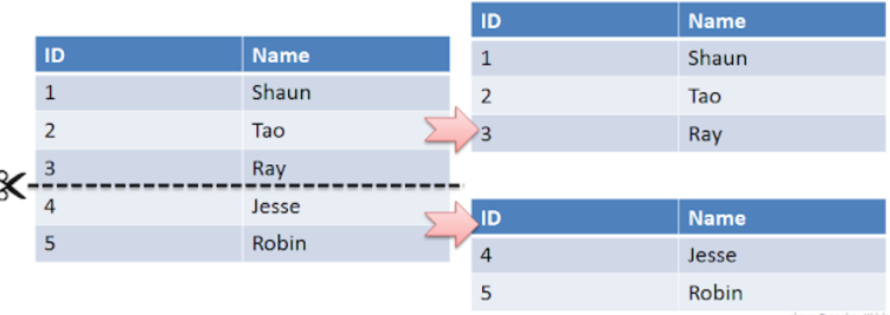
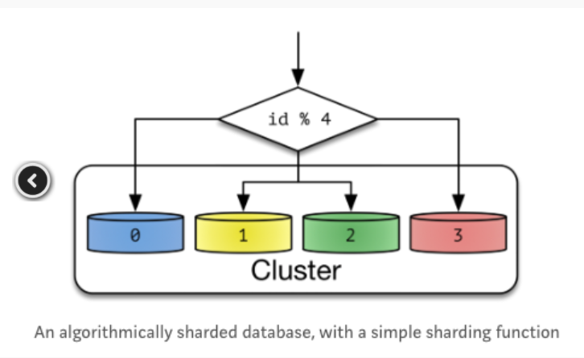
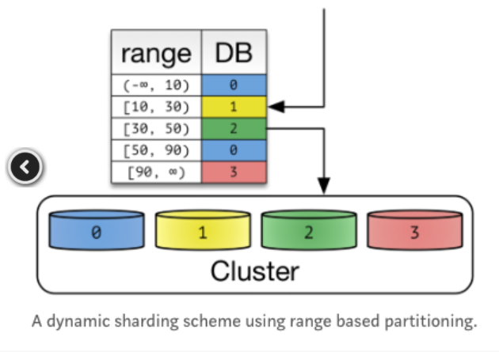
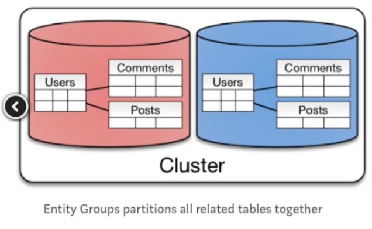

# DATABASE

**:Contents**
* [database pool(connection pool)](#database pool(connection pool))
* [connection pool 옵션](#connection_pool_옵션)
* [정규화(1차 2차 3차 BCNF)](#정규화(1차-2차-3차-BCNF))
* [트랜잭션 격리 수준(Transaction Isolation Level)](#트랜잭션-격리-수준)
* [트랜잭션 전파 방식(Transaction propagation)](#트랜잭션-전파-방식)
* [트랜잭션이란](#트랜잭션이란)
* [Index를 타지 않는 경우](#Index를-타지-않는-경우)
* [Index의 자료구조는 / 특징은](#Index의-자료구조는-특징은)
* [수정 삭제가 잦은 칼럼에 Index가 적합하지 않은 이유](#수정삭제가-잦은-칼럼에-Index가-적합하지-않은이유)
* [Statement와 PrepareStatement](#Statement와-PrepareStatement)
* [RDBMS와-NoSQL](#RDBMS와-NoSQL)
* [샤딩](#샤딩)
* [Replication](#Replication)
* [파티셔닝](#파티셔닝)
* [mybatis_캐시](#mybatis_캐시)
* [데이터베이스 락](#락)
* [clustered Index/Nonclustered Index](#clustered_Index)
* [mybatis # $ 차이점](#mybatis)
* [innoDB myisam 차이점](#innoDB_myisam_차이점)
* [database timeout](#timeout)
* [클러스트링 인덱스 vs 논 클러스트링 인덱스]
* [mybatis resultMap vs resultType](#resultMap vs resultType)
* [ibatis mybatis 차이](#ibatis_mybatis_차이)
* [mysql expalin 항목](mysql_expalin_항목)

---


### database pool(connection pool)
#### Connection Pool?
- 애플리케이션의 스레드에서 데이터베이스에 접근하기위해 Connection이 필요
- 데이터베이스와 Connection한 객체들을 미리 생성해 Pool에 저장해두었다가, 클라이언트의 요청이 들어올 때마다 사용/반환하는 방식

#### Connection Pool 데이터베이스 접근 과정
(1) 웹 컨테이너가 실행되면 데이터베이스와 연결된 Connection 객체들을 미리 생성해 Pool에 저장    
(2) 클라이언트 요청 시 Pool에서 Connection 객체를 가져와 데이터베이스 접근    
(3) 요청 처리가 끝나면 사용된 Connection 객체를 다시 Pool에 반환    

#### Connection Pool 장점    
- 매 연결마다 Connection 객체를 생성/제거하는 비용 감소    
- 미리 생성된 Connection 객체를 사용하므로 데이터베이스 접근 시간 단축    
- Connection 수를 제한해 부하 조정    

#### Connection Pool 단점  
- Connection 또한 객체이므로 메모리 차지    
- Connection 개수를 잘 못 설정할 경우, 쓸모없는 Connection이 발생할 수 있음

#### Connection이 부족할 경우
- 모든 Connection이 요청을 처리 중일 때, 해당 클라이언트의 요청을 대기 상태로 전환
- Pool에 Connection 객체가 반환되면 순차적으로 요청을 처리

#### Thread Pool과 Connection Pool
- Thread Pool은 작업 처리에 사용되는 스레드를 제한된 개수만큼 정해 놓고 작업 큐(Queue)에 들어오는 작업들을 하나씩 스레드가 맡아 처리하는 것
- WAS(Web Application Server)에서 Thread Pool과 Connection Pool의 Thread와 Connection의 수는 메모리와 직접적으로 관련이 있음
- Connection과 Thread 수를 많이 설정하면 메모리를 많이 차지하고, 반대로 적게 설정할 경우 처리하지 못하는 대기 요청이 많아짐


-----------------------------------------------

### connection pool 옵션

`initailsize`<br>
* 최초로 커넥션을 맺을 때 Connection Pool에 생성되는 커넥션 개수

`maxWait`<br>
* 커넥션 풀에 연결 가능 커넥션이 없을 경우 반납되는 커넥션을 대기하는 시간 (단위 : millisecond, 10,000ms = 10초)

`maxActive`<br>
* 동시에 사용할 수 있는 최대 커넥션

`validationQuery`<br>
* DB를 사용하기 전에 해당 connection 이 정상적인지 검사

`testOnBorrow`<br>
* 커넥션 풀에서 커넥션을 얻어올 때 테스트 실행


`testOnReturn`<br>
* 커넥션 풀로 커넥션을 받환할 때 테스트 실행


`maxIdle`<br>
* 사용한 커넥션을 풀에 반납 시 최대로 유지할 개수

`minIdle`<br>
* 최소한으로 유지할 커넥션 개수

`timeBetweenEvictionRunsMillis`<br>
* Evictor 스레드 동작 간격. 기본적으로 비활성화 되어 있다.


`<br>Evictor 스레드`<br>
* Commons DBCP 내부에서 커넥션 자원을 정리하는 구성 요소이며 별도의 스레드로 실행된다.

-----------------------------------------------
### 정규화(1차 2차 3차 BCNF)
#### 정규화(Normalization)란 하나의 릴레이션에 하나의 의미만 존재할 수 있도록 릴레이션을 분해해 나가는 과정
- 비정규형은 하나의 튜플에서 속성을 입력되는 도메인 값으로 여러 개의 값이 들어와서 원자성(Atomic)을 가지지 못한 경우
>  

- 제1 정규형 과정을 통해 원자값이 아닌 도메인을 분해하여 어떤 릴레이션 R에 속한 모든 도메인이 원자값으로만 되어 있도록 설계
>  

- 제2 정규형(Second Normal Form : 2NF)은 어떤 릴레이션 R이 제1정규화에 속하고 기본키에 속하지 않는 모든 속성이 키본키에 완전 함수적 종속이면 충족하는 정규화
>  

- 제3 정규형(Third Normal Form : 3NF)은 어떤 릴레이션 R이 제2정규화에 있으며 기본키에 속하지 않는 모든 속성이 기본키에 이행적 함수 종속이 아닌 상태의 관계
>  

- 보이스 코드 정규형(Boyce-Codd Normal Form : BCNF)은 릴레이션 R의 모든 결정자가 후보키이면 릴레이션 R은 Boyce-Codd 정규형에 속하는 상태.
>  

- BCNF 정규형에 속하는 릴레이션은 모두 제3 정규형에 속하지만 역으로는 성립되지 않는다는 점도 기억해 두어야 할 중요한 포인트


cf) https://minimax95.tistory.com/entry/%EC%A0%95%EA%B7%9C%ED%99%94Normalization-%EA%B0%9C%EB%85%90%EA%B3%BC-%EA%B8%B0%EB%B3%B8-%EA%B3%BC%EC%A0%95


-----------------------------------------------

### 트랜잭션
- 여러개의 작업이 발생할때 하나의 단위로 묶어 일괄 실행, 일괄 취소 할수있게 해주는것. 중간에 에러가 발생하면 없던일로 처리할 수 있다. 	
- 특성 ACID
> 원자성-Atomicity(모두 실행되던지, 아니면 전혀 실행되지 않던지)
> 일관성-Consistency(실행전 내용 잘못되어있지 않으면 후에도 잘못되지 않아야한다)
> 고립성-Isolation(다른트랜잭션 영향X)
> 지속성-Durability(트랜잭션이 성공적으로 완료되었으면 결과는 영구히 반영되어야 한다.)

### 트랜잭션 격리 레벨
#### 트랜잭션 격리 레벨
- 동시에 여러 트랜잭션이 진행될 때에 트랜잭션의 작업 결과를 여타 트랜잭션에게 어떻게 노출할 것인지를 결정하는 기준
- 스프링 DEFAULT : 사용하는 DB 드라이버의 디폴트 설정을 따른다. 대부분의 DB는 READ_COMMITTED를 기본 격리수준으로 갖는다. 

1. READ_UNCOMMITTED 
   - 가장 낮은 격리수준. 하나의 트랜잭션이 커밋되기 전에 그 변화가 다른 트랜잭션에 그대로 노출되는 문제가 있다. 
   - 하지만 가장 빠르기 때문에 데이터의 정합성이 조금 떨어지더라도 성능을 극대화할 때 의도적으로 사용함.
   - 각 트랜잭션의 변경 내용이 COMMIT / ROLLBACK 여부에 상관 없이 다른 트랜잭션에서 값을 읽을 수 있다.
   - COMMIT 되지 않은 상태지만, UPDATE 된 값을 다른 트랜잭션에서 읽을 수 있다.
	
2. READ_COMMITTED
   - 실제로 가장 많이 사용되는 격리수준. 물론 스프링에서는 DEFAULT로 설정해둬도 DB의 기본 격리수준을 따라서 READ_COMMITTED로 동작하는 경우가 대부분이므로 명시적으로 설정하지 않기도 한다. 
   - READ_UNCOMMITTED와 달리 다른 트랜잭션이 커밋하지 않은 정보는 읽을 수 없다. 대신 하나의 트랜잭션이 읽은 로우를 다른 트랜잭션이 수정할 수 있다. 이 때문에 처음 트랜잭션이 같은 로우를 읽을 경우 다른 내용이 발견될 수 있다.
   -실제 테이블 값을 가져오는 것이 아니라 Undo 영역에 백업된 레코드에서 값을 가져온다.   
   -   
  
3. REPEATABLE_READ  =  gap lock(0)
   - MySQL에서는 트랜잭션마다 트랜잭션 ID를 부여하여 트랜잭션 ID보다 작은 트랜잭션 번호에서 변경한 것만 읽게 된다.
   - Undo 공간에 백업해두고 실제 레코드 값을 변경한다.
   - 백업된 데이터는 불필요하다고 판단하는 시점에 주기적으로 삭제한다.
   - Undo에 백업된 레코드가 많아지면 MySQL 서버의 처리 성능이 떨어질 수 있다.
   - 하나의 트랜잭션이 읽은 로우를 다른 트랜잭션이 수정하는 것을 막아준다. 하지만 새로운 로우를 추가(insert)하는 것은 제한하지 않는다. 따라서 SELECT로 조건에 맞는 로우를 전부 가져오는 경우 트랜잭션이 끝나기 전에 추가된 로우가 발견될 수 있다.
   -   
   -   
      
4.SERIALIZABLE
   - 가장 강력한 트랜잭션 격리수준. 트랜잭션을 순차적으로 진행시켜 주기 때문에 여러 트랜잭션이 동시에 같은 테이블의 정보를 액세스하지 못한다. 
   - 가장 안전한 격리수준이지만 가장 성능이 떨어지기 때문에 극단적인 안전한 작업이 필요한 경우가 아니라면 자주 사용되지 않는다.

#### Dirty Read & Non-Repeatable Read & Phantom Read    
* Dirty Read
> - 트랜잭션 작업이 완료되지 않았는데, 다른 트랜잭션에서 볼 수 있게 되는 현상

* Non-Repeatable Read
> - 한 트랜잭션 내에서 같은 쿼리를 두 번 수행했는데, 그 사이에 다른 트랜잭션이 값을 수정 또는 삭제함으로써 두 쿼리 결과가 다르게 나타나는 현상을 말한다.
 
* Phantom Read
> - 한 트랜잭션에서 같은 쿼리를 두 번 수행할 때, 첫 번째 쿼리에서 없던 레코드가 두 번째 쿼리에서 나타나는 현상
> - 한 트랜잭션이 수행 중일 때 다른 트랜잭션이 새로운 레코드를 INSERT 함으로써 나타난다.   
> - REPEATABLE_READ 격리 수준에서는 공유 잠금인 상태의 데이터에 대해 변경 불가가 보장되었다. 하지만, 그 데이터를 변경시키지 못할 뿐 새로운 데이터를 추가/삭제하는 것은 가능하다. 이것을 팬텀 읽기(Phantom read, 가상 읽기)라고 부른다
> - 트랜잭션 중에 없던 행이 추가되어 새로 입력된 데이터를 읽는 것 또는 트랜잭션 중에 데이터가 삭제되어 다음 읽기시 이전에 존재하던 행이 사라지는 것을 팬텀 읽기라고 한다.
 
  

cf)
https://nesoy.github.io/articles/2019-05/Database-Transaction-isolation    
https://mysqldba.tistory.com/334    
https://medium.com/@wonderful.dev/isolation-level-%EC%9D%B4%ED%95%B4%ED%95%98%EA%B8%B0-94e2c30cd8c9
https://suhwan.dev/2019/06/09/transaction-isolation-level-and-lock/

-----------------------------------------------------------------------
 
### 트랜잭션 전파 방식 
- 트랜잭션을 시작하거나 기존 트랜잭션에 참여하는 방법을 결정하는 속성	   
- REQUIRED: 현재 진행중인 트랜잭션이 있으면 그것을 사용하고, 없으면 생성한다. [DEFAULT 값]
- MANDATORY: REQUIRED와 비슷. 현재 진행중인 트랜잭션이 있으면 그것을 사용하고, 없으면 Exception 발생. 혼자서는 독립적으로 트랜잭션을 진행하면 안 되는 경우에 사용
- REQUIRES_NEW: 항상 새로운 트랜잭션을 시작. 
- SUPPORTS: 이미 진행중인 트랜잭션이 있으면 그것을 사용. 없으면 그냥 트랜잭션 없이 진행.
- NOT_SUPPORTED: 트랜잭션 사용하지 않게 한다. 이미 진행중인 트랜잭션이 있으면 보류
- NEVER: 트랜젝션을 사용하지 않도록 강제한다. 이미 진행중인 트랜잭션도 존재하면 안됨. 있다면 예외 발생
 
    @Transactional(propagation = Propagation.REQUIRES_NEW)
 	public void doSomething() { 
		
	}
	
	
#### REQUIRES_NEW는 부모 트랜잭션에서 완전 독립적인 트랜잭션을 생성하는가 ?

https://jobc.tistory.com/214

#### 트랜잭션 read only에 동작 방식

https://lob-dev.tistory.com/entry/DBMS-%EB%B3%84-Transaction-Read-Only%EC%97%90-%EB%8C%80%ED%95%9C-%EB%8F%99%EC%9E%91-%EB%B0%A9%EC%8B%9D-1
	
### 인덱스가 존재하지만 인덱스를 타지 않는 경우

#### 인덱스란
* 인덱스는 결국 지정한 컬럼들을 기준으로 메모리 영역에 일종의 목차를 생성하는 것입니다.
* insert, update, delete (Command)의 성능을 희생하고 대신 select (Query)의 성능을 향상시킵니다.

#### 1. 인덱스 컬럼을 변형하는 경우
* 수식이나 함수 등으로 인덱스 컬럼 절을 변형하였을 경우  
* 반드시 함수나 수식을 사용해야하는 경우에는 인덱스 컬럼에 적용하지 말고, 대입되는 컬럼이나 상수에 적용해야 한다.  

**원인**<br>
column 이 변형이 되여 있고 index는 대문자 소문자 혹은 대소문자 혼합되여<br>
구성되여 있을것이고 그리고 그것을 소트하여 인덱스를 만들어 놓았는데<br>
그것을 대문자로 변형   홍길동을 찾으라고 하면    해당 table을 전체를 full scan 하게 된다<br>
<br>
처음부터 입력된 값을 대문자만 들어가게 table을 설계 했던지 아니면 table의 입력 값이
전부 소문자면 소문자로 변형 처리 하면 인덱스의 변형은 되지 않는다<br>

```oracle
SELECT column_name FROM table_name WHERE TO_CHAR(column_name, 'YYYYMMDD') = '20201204';
> SELECT column_name FROM table_name WHERE column_name = TO_DATE('20201204', YYYYMMDD);
```
```oracle
SELECT column_name FROM table_name WHERE column_name * 100 > 10000;
> SELECT column_name FROM table_name WHERE column_name > 10000 / 100;
```
  
#### 2. 내부적으로 데이터 형 변환이 일어난 경우
* 서로 대입되는 항목끼리 데이터 타입이 다르면 내부적인 형 변환에 의해 컬럼이 함수를 사용한 것과 같은 효과를 나타낸다.

```oracle
SELECT column_name FROM table_name WHERE column_name = '20201204';
> SELECT column_name FROM table_name WHERE column_name = TO_DATE('20201204', 'YYYYMMDD');
```
```oracle
SELECT column_name FROM table_name WHERE column_name  = 100;
> SELECT column_name FROM table_name WHERE column_name  = '100';
```
  
#### 3. 조건절에 NULL 또는 NOT NULL 을 사용하는 경우
* 기본적으로 인덱스를 구성한 컬럼 값이 전부 NULL 이라면 인덱스는 null 값을 저장하지 않음. 
따라서 NULL 인 값이 많지 않아 인덱스를 통해 엑세스를 하고자 한다면 데이터 생성 시 디폴트로 0과 같이 데이터를 만들어주 는 것이 좋다. 
만약, NOT NULL 이 분석 대상이라면 해당 컬럼을 NULL 허용 컬럼으로 두는 것이 좋다.

```oracle
SELECT column_name FROM table_name WHERE column_name IS NULL;
SELECT column_name FROM table_name WHERE column_name IS NOT NULL;
```
```oracle
SELECT column_name FROM table_name WHERE column_name = '';
SELECT column_name FROM table_name WHERE column_name >= 0;
```
  
#### 4. 부정형으로 조건을 사용한 경우
#### 4. 부정형으로 조건을 사용한 경우
* 부정문은 인덱스를 활용하지 못한다.

**원인**<br>
예를 들어 CAR가 아닌 것을 조회하라고 한다면<br>
무었 무었을 찾아라 가 아니고  CAR 가 아닌 것이 무었인지 모르지만 그것을 찾아라<br>
이런 문장은 CAR가 아닌것이 무었인지 전부 찾아 보아라 하는 말이다<br>


```oracle
SELECT column_name FROM table_name WHERE column_name != 30;
>SELECT column_name FROM table_name WHERE column_name < 30 AND column_name > 30;
```
또는 테이블을 한 번 더 읽어 NOT EXISTS 를 사용
```oracle
SELECT column_name FROM table_name WHERE NOT EXISTS
   (SELECT column_name FROM table_name WHERE column_name = 30);
```
  
#### 5. LIKE 연산자를 잘못 사용하는 경우
* LIKE 연산자를 사용하는 경우 맨 앞에 %가 있으면 인덱스를 타지 않는다.
```oracle
SELECT column_name FROM table_name WHERE column_name LIKE '%S%';
> SELECT column_name FROM table_name WHERE column_name LIKE 'S%';
```
가능하면 INSTR 함수 사용할 것(비교하고자 하는 값이 없으면 0반환, 있으면 시작 위치 반환)
```oracle
SELECT column_name  FROM table_name WHERE INSTR(column_name , 'cmp_value') > 0;
```

#### 6. OR 조건 사용
```oracle
SELECT * FROM table_name  WHERE column_name = 'yunseop' or name = 'song';
> SELECT * FROM table_name  WHERE column_name = 'yunseop';
  UNION ALL 
  SELECT * FROM table_name  WHERE column_name = 'song';
```
cf)
http://dbcafe.co.kr/wiki/index.php/%EC%98%A4%EB%9D%BC%ED%81%B4_%EC%9D%B8%EB%8D%B1%EC%8A%A4_%ED%83%80%EC%A7%80_%EC%95%8A%EB%8A%94_%EA%B2%BD%EC%9A%B0
https://code-factory.tistory.com/24
https://winmargo.tistory.com/61

### Index 자료구조
#### B-Tree 구조
* B트리는 이진트리에서 발전되어 모든 리프노드들이 같은 레벨을 가질 수 있도록 자동으로 벨런스를 맞추는 트리입니다.
* 정렬된 순서를 보장한다.

내부적으로는 여러 방식으로 구현하지만, 제일 보편적인 것이 B-Tree 인덱스이다.  
storage engine 에 따라 인덱스 구조가 다른데 MySQL 의 경우에 가장 많이 사용하는 storage engine 인 InnoDB, MyISAM 같은 경우에는 B-Tree 로 되어 있고,
Memory/Heap, NDB 등은 HASH 와 B-Tree 로 되어있다.
  

B-Tree 인덱스는 Root Block, Branch Block, Leaf Block 으로 나누어지며, 그림과 같이 Leaf block 은 양방향 링크를 가지고 있어서, 오름차순, 내림차순 검색이 가능하다.  
  
#### B-Tree 동작 방식
* 1단계, 브랜치 블록의 가장 왼쪽 값이 찾고자 하는 값보다 작거나 같으면 왼쪽 포인터로 이동  

* 2단계, 찾고자 하는 값이 브랜치 블록의 값 사이에 존재하면 가운데 포인터로 이동  

* 3단계, 오른쪽에 있는 값보다 크면 오른쪽 포인터로 이동  

  
예를 들어 37의 값을 찾고 싶다면??  
* 37을 찾고자 한다면 루트블록에서  50보다 작으므로 왼쪽 포인터로 이동한다.

* 37는 왼쪽 브랜치 블록의 11과 40 사이의 값이므로 가운데 포인터로 이동한다.

* 이동한 결과 해당 블록이 리프블록이므로 37이 블록 내에서 존재하는지 검색한다. 
  
  

또 예를 들어 만약 37~50의 값을 찾고 싶다면??  

* 앞에서와 같이 37을 찾은다음에 정렬되어 있는 링크를 따라 50까지 검색해주면 된다.
  
cf)
https://slenderankle.tistory.com/284

### Index 가 수정,삭제가 많이 일어나는 테이블에 맞지 않는 이유
인덱스는 또 다른 기존 테이블외에 인덱스 테이블을 가지고 있기때문에 사용하면 검색속도가 빨라진다.
하지만 DML(insert, update, delete) 이 자주 일어나는 테이블의 경우에는 오히려 성능이 떨어질 수 있다.
기본적으로 인덱스는 데이터를 삭제하더라도 사용안함 표시를 해주고 끝이지 실제로 사라지는 것이 아니다. 또한 update 문을 사용해서 
데이터를 수정하는 경우에도 우리 눈에는 그냥 수정만 된것이지만 내부적으로는 delete 후에 다시 insert 해주는 로직을 따르고 있다.
그렇기 때문에 DML 이 자주 일어나는 table 에서는 오히려 인덱스 테이블이 원래 테이블보다 크기가 커지는 경우가 발생하게 되고, 그렇게 되면 인덱스를 사용하는 의미가 사라진다.  
  
### Statement 와 PrepareStatement 의 차이
PrepareStatement 는 Statement 를 상속받았다.  
그리고 이 둘의 가장 큰 차이점은 캐시 사용 여부이다.  
* 쿼리 문장 분석
* 컴파일
* 실행  
Statement 를 사용하면 매번 쿼리를 수행할 때마다, 위 3단계를 거친다. 
하지만 PrepareStatement 의 경우는 처음 한 번만 위의 단계를 거치고 그 다음에는 캐시에 담아 재사용한다.  
  
뚀한, PrepareStatement 는 동적인 쿼리문을 처리할 수 있다. 그래서 같은 SQL 문에서 값만 변경하여 사용한다던지, 인수가 많은 경우에 사용하기 좋다.
Statement 는 쿼리 실행이 적을 경우 사용하면 좋을 것이고, PrepareStatement 는 쿼리 실행이 많고 동적인 쿼리문이 있을 경우 사용하면 좋을 것이다.
  
### RDBMS & NoSQL
#### RDBMS  
RDBMS는 정해져있는 데이터 스키마에 따라 데이터베이스 테이블에 저장되며, 관계를 통한 테이블간 연결을 통해 사용된다. 이 때문에 RDBMS는 데이터 관리를 효율적으로 하기위해 구조화가 굉장히 중요하다.
  
※스키마란?  
데이터베이스에서 자료의 구조, 자료의 표현 방법, 자료 간의 관계를 형식 언어로 정의한 구조이다. 
데이터베이스 관리 시스템(DBMS)이 주어진 설정에 따라 데이터베이스 스키마를 생성하며, 
데이터베이스 사용자가 자료를 CURD 할 때, DBMS는 자신이 생성한 데이터베이스 스키마를 참조하여 명령을 수행한다.

#### NoSQL
NOSQL 은 Not Only SQL, Non relational Database 라고 부른다. 
NOSQL은 관계형 데이터베이스와 반대되는 방식을 사용하여 스키마와 관계라는 개념이 없다. 
RDBMS에서는 스키마에 맞추어 데이터를 관리하여야 하지만 NOSQL은 스키마가 없어 좀 더 자유롭게 데이터를 관리할 수 있다. 
NOSQL에서 테이블과 같은 개념으로 컬렉션이라는 형태로 데이터를 관리한다.
  
  
  
※수직적 확장? 수평적 확장?  
* 수직적 확장이란 기존의 서버를 더 좋은 H/W로 바꾸는 방법(scale up)  
* 수평적 확장은 기존에 사용하던 서버 외에 서버를 추가하여 성능을 높이는 방법(scale out)


-----------------------------------------------------------------------

### 샤딩
>> 데이터가 많아서 검색이 느린데 더 빠르게 할 수 있는 방법은 없을까?


* 샤딩은 수평 분할(Horizontal Partitioning)과 동일하며, 인덱스의 크기를 줄이고, 작업 동시성을 늘리기 위한 것이다.

* 수평 분할(Horizontal Partitioning)이란 스키마(schema)가 같은 데이터를 두 개 이상의 테이블에 나누어 저장하는 디자인을 말한다. 

* 가령 같은 주민 데이터를 처리하기 위해 스키마가 같은 '서현동주민 테이블'과 '정자동주민 테이블'을 사용하는 것을 말한다. 

* 데이터베이스를 샤딩하게 되면 기존에 하나로 구성될 스키마를 다수의 복제본으로 구성하고 각각의 샤드에 어떤 데이터가 저장될지를 샤드키를 기준으로 분리한다.


  


>> 프로그래밍, 운영적인 복잡도는 더 높아지는 단점이 있습니다.

`가능하면 Sharding을 피하거나 지연시킬 수 있는 방법을 찾는 것이 우선되어야 합니다.`

* Scale-in
>> Hardware Spec이 더 좋은 컴퓨터를 사용합니다.

* Read 부하가 크다면?
>> Cache나 Database의 Replication을 적용하는 것도 하나의 방법입니다.

* Table의 일부 컬럼만 자주 사용한다면?
>> Vertically Partition도 하나의 방법입니다.
>Data를 Hot, Warm, Cold Data로 분리하는 것입니다.


`기본개념을 넘어 좀더 자세히 알자보자면!!`

>> 분산된 DB에서 어떻게 Data를 읽어오기 위해 `Shard Key`에 대한 방식을 선택해야 한다.

**`Algorithm Sharding`**

  

* Database id를 단순하게 나누어 샤딩하는 방식
* Sharding Key는 hash(key) % NUM_DB 같은 방식

`장점`
같은 값을 가지는 key-value 데이터베이스에 적합하다.

`단점`
Cluster를 포함하는 Node 갯수가 변하게 되면 Resharding이 필요하다.
Hash Key로 분산되기 때문에 공간에 대한 효율이 부족하다.


**`Dynamic Sharding`**

  

* 클라이언트는 Locator Service에 접근하여 Shard Key를 얻는다.

`장점`
Cluster가 포함하는 Node 갯수가 변하면 Shard Key를 추가하기만 하면 된다.

>> 확장에 유연하게 대처가능하다.

`단점`
Data Relocation시에는 Locator Service의 Shard key Table도 일치시켜야 한다.

>> Locator에 의존할 수 밖에 없는 구조이다.


**`Entity Group`**

  

* Database id를 단순하게 나누어 샤딩하는 방식
* Sharding Key는 hash(key) % NUM_DB 같은 방식

`장점`
같은 값을 가지는 key-value 데이터베이스에 적합하다.

`단점`
Cluster를 포함하는 Node 갯수가 변하게 되면 Resharding이 필요하다.
Hash Key로 분산되기 때문에 공간에 대한 효율이 부족하다.

`출처`
https://sophia2730.tistory.com/entry/Databases-Database-Sharding%EC%83%A4%EB%94%A9
* 좀더 이해하기 좋은 사이트
https://techblog.woowahan.com/2687/

-----------------------------------------------------------------------


### Replication
* 2개 이상의 DBMS를 Master와 Slave로 나누어 동일한 데이터를 저장한다.

* Master DB는 Insert, Update, Delete의 기능을 수행하고, Slave DB에 실제 데이터를 복사한다.

* Slave DB 시간이 오래걸리는 Select문의 기능을 수행하여 전체적인 Select문 성능을 향상시킨다.

`DB 이중화`
* master db에서는 insert , update ,delete 작업 , slave db에서는 read용으로 사용
* mysql replication을 통해 데이터 복제

  

`replication 장점`
* DB 서버 부하 분산
* master db 장애시 slave db로 대체 가능

`replication 단점`
* Master-Slave pair 관리:서버들이 많아질 경우, Master와 Slave의 짝을 관리하는 것이 쉽지 않다.

* 실패 상황에서의 복구 : Master가 실패시 Master와 Slave의 교체, 혹은 Slave의 데이터를 Master로 복사하는 등의 작업을 수동으로 진행하여야 한다. Slave의 실패인 경우도 마찬가지이다.

* binary log의 관리: Master 에 쌓이는 binary log에 대한 관리 또한 수동으로 처리하여야 한다.(cron등을 이용하여 정기적인 삭제 필요)

* replication 지연발생: Master의 처리량이 많은 경우 Slave는 지연시간이 발생하게 되고 그 시간동안의 데이터는 일치하지 않는 문제가 있다.

-----------------------------------------------------------------------

### 파티셔닝
VLDB(Very large DBMS)

*전체 DB가 하나의 DBMS시스템에 다 들어가기 힘들어지는 경우 
>> 테이블 들을 여러 개의 군으로 나눠 분산 저장 
* 하나의 테이블이 방대한 경우에는 사전방식과 같이 나눠 저장 

`파티셔닝`
*DBMS 레벨 분할

`샤딩`
*DBMS 외부에서 분할 / 응용레벨에서 구별해야 함

`이점`
* 데이터 전체 검색시 필요한 부분만 탐색해 성능 증가

*전체 데이터를 손실할 가능성이 줄어듦 -> 가용성향상

*파티션별 백업/복구 가능

*파티션 단위로 I/O 분산가능 -> 업데이트 성능 증가 

`방식`
*범위(range) a-m/n-r/s-z

*해시(hash) 해시함수 파티션별로 크기를 비슷하게 나눔

*리스트(list) 특정한 컬럼을 기준


EX) Card  테이블에 연도 (CreationTime) 컬럼을 추가하고 파티셔닝하시오.

```mysql
create table businessCard(ID INT NoT Null, Name varchar(255), Address varchar(255) ,
 Telephone varchar(255) , CreateTime DATE)
 
PARTITION BY RANGE(YEAR(CreationTime)) (
PARTITION p0 VALUES LESS THAN(2013),
PARTITION p1 VALUES LESS THAN(2014),
PARTITION p2 VALUES LESS THAN(2015),
PARTITION p3 VALUES LESS THAN MAXVALUE);  
```


**파티션 추가 와 삭제** 

```mysql
ALTER TABLE Card ADD PARTITION(PARTITION p4 VALUES LESS THAN(2005));
 
ALTER TABLE Card DROP PARTOTION p4;
```

**파티션 분할 / 병합**

```mysql
ALTER TABLE CardREORGANIZE
 PARTITION p3 INTO(PARTITION p3 VALUES LESS THAN(2015),
PARTITION p4 VALUES LESS THAN MAXVALUE);
```

>> 파시션을 하여 정보를 나누웠는데도 P3에 데이터가 많은 경우 P3을 P3 ,P4로 더욱 분할하는 경우


```mysql
ALTER TABLE Card
REORGANIZE PARTITION p2,p3
 INTO(PATITION p23 VALUES LESS THAN(2014));
```
 
>> 파티션을 P2 , P3으로 만들었지만 데이터가 적어서 P23으로 병합하는 경우


### mybatis_캐시

#### Local cache
* MyBatis에는 Local cache라는게 있는데 이녀석은 끌 수없고 항상 활성화
* SESSION과 STATEMENT라는 설정 범위를 갖고있고 SESSION이 기본값
* STATEMENT와 SESSION의 차이는 캐시데이터의 생존범위

따로 설정이 없다면 기본설정인 SESSION과 범위로 되어 있습니다.
범위를  STATEMENT로 변경하고 싶다면!

spring boot 사용시(application.properties)
```properties

# mybatis local cache
mybatis.configuration.local-cache-scope=statement

```

`SESSION`

SESSION을 적용했을때 cache의 정보의 생존범위는 session이 유지되는 순간까지 이다.<br>
즉 Transaction이 끝나거나(commit이나 rollback) 아니면 insert, update, delete 가 실행되면<br>
Local cache가 보유하고 있던 cache 정보는 폐기된다.


`STATEMENT`

mapper에 정의된 액션(<select> .. ,</select>  <update> ..</update>) 하나까지 유지<br>
사실상 cache를 거의 사용하지 않는 것과 같은 효과이다.

```xml

<select id="selectStationName" resultType="String">
   select
     stationName
    from tblStation
    order by seq asc
</select>

```

#### Second level cache
* Second level cache 는 Local cache 와는 다르게 비활성화 활성화가 가능

Second level cache를 활성화 하고 싶다면

```properties

# mybatis second level cache
mybatis.configuration.cache-enabled=true

```

mapper.xml에서 설정을 해줘야한다.

```xml

<cache 
    id="LRU" 
    resultType="300000"
    size="5"
    readonly="true"
/>

```
* eviction: 캐시 알고리즘 속성으로 기본은 LRU(사용빈도가 낮은것)이고 그 외에 3가지가 있음. FIFO(선입선출).
* flushInterval: 캐시 유지 설정1분 뒤 캐시 비움.(단, 특정 시각을 정하지는 못함)
* size: 디폴트 값은 1024이며, 메모리 여부를 확인 후 사용해야 할 듯.
* readOnly: 캐시 데이터를 읽기만 가능하게 할지 설정. (읽기/쓰기 모두 가능한 경우에는 반환된 캐시 데이터에 대한 변경이 가능하며, 캐시 복사본을 반환한다고 함)


위에 선언을 해주고 사용할 statement에 <br>
select 안에 useCache 옵션을 True로 설정해주면 해당 Statement의 결과가 캐시된다.


* Second level cache는 Session 범위 밖에서의 캐시사용 여부를 조정한다. 
* Local cache는 Statement 실행후 Commit이 되면 캐시를 지우는데 반해 Second level cache는 commit을 해도 캐시데이터가 살아있다. 


>> mybatis cache는 이와같고 mybatis cache는 잘사용하지 않으며 DAO단의 캐시보단는 ehcache ,redis를 이용한 service단의 캐시를 고려하는게 좋은거 같다.


`출처`
https://jp1020.tistory.com/entry/mybatis-cache-설정
https://idea-sketch.tistory.com/31?category=547413

### 데이터베이스 락
`shared lock`<br> 
* 다른 사용자가 동시에 읽을 수는 있지만 , update ,delete를 방지함

보통 데이터를 읽을 때 사용합니다.<br>
 원하는 데이터에 lock을 걸었지만 다른 세션에서 읽을 수 있습니다.<br> 
 공유Lock을 설정한 경우 추가로 공유Lock을 설정할 수 있지만, 배타적 Lock은 설정할 수 없습니다.<br> 
 즉, 내가 보고 있는 데이터는 다른 사용자가 볼 수 있지만, 변경할 수는 없습니다.<br> 

`exclusive lock`<br>
* 다른 사용자 읽기,수정,삭제 모두를 불가능하게 함

보통 데이터를 변경할 때 사용합니다. <br> 
이름에서 느껴지는 것 처럼 해당 Lock이 해제되기 전까지는, 다른 공유Lock, 배타적Lock을 설정할 수 없습니다.<br> 
즉, 읽기 기와 쓰기가 불가능하다는 의미입니다.<br> 

`innoDB`<br>
* Row-level lock
    * 테이블의 row마다 걸리는 row-level lock이다.
* Record lock
    *  DB의 index record에 걸리는 lock이다. 
    
c1 = 10에 조건에 해당하는 Record에 걸리는 락
```sql

(Query 1 in transaction A)
SELECT c1 FROM t WHERE c1 = 10 FOR UPDATE;

```
* Gap lock
    *  Gap lock은 DB index record의 gap에 걸리는 lock이다. 여기서 gap이란 index 중 DB에 실제 record가 없는 부분이다.


>> record lock이 이미 존재하는 row가 변경되지 않도록 보호하는 반면,
>> gap lock은 조건에 해당하는 새로운 row가 추가되는 것을 방지하기 위함이다.

cf ) .https://chrisjune-13837.medium.com/db-lock-%EB%9D%BD%EC%9D%B4%EB%9E%80-%EB%AC%B4%EC%97%87%EC%9D%B8%EA%B0%80-d908296d0279


### mybatis # $ 차이점
>> 사용의 용도가 다르다.

`#`<br>
* 쿼리문을 작성할 때 #{}을 사용하는 경우 PreparedStatement를 생성하게 되는데 위의 ?에 파라미터가 바인딩되어 수행된다.
* 파싱된 쿼리문은 재활용(캐싱)되기 때문에 효율적이다
* 변수에 작은 따옴표(‘)가 자동으로 붙여 쿼리가 수행되기 때문에 '#{id}'와 같은 식으로 쿼리문을 작성하지 않아도 된다
* 쿼리 주입을 예방 할 수 있어 보안상 유리하다.

`$`<br>
* 값이 넣어진 채로 쿼리문이 수행된다. 그렇기 때문에 파라미터의 값이 바뀔 때마다 항상 쿼리문 파싱을 진행해야 한다.
* 성능상의 단점이 존재한다.
* 쿼리 주입 예방이 되지 않아 보안상 좋지 않다.
* 테이블,칼럼명을 파라미터로 전달 할 때 사용한다.


### database timeout

`TransactionTimeout`<br>
>> 전체 Statement 수행 시간을 허용할 수 있는 최대 시간 이내로 제한하려 할 때 TransactionTimeout을 사용한다.

`StatementTimeout`<br>
>> Statement 하나가 얼마나 오래 수행되어도 괜찮은지에 대한 한계 값이다.

* 요즘 개발 환경에서는 개발자가 직접 StatementTimeout을 Java 코드로 설정하는 경우는 드물며, 프레임워크를 이용하여 해결하는 경우가 많다
* iBatis를 예로 들어 설명하자면 "sql-map-config.xml" 파일의 sqlMapConfig/settings에 @defaultStatementTimeout 값으로 기본값을 설정할 수 있다
* "sql-map.xml" 파일의 statement, select, insert, update 구문마다 @timeout 값으로 개별적으로 설정할 수 있다

`JDBC 드라이버의 SocketTimeout`<br>
>> JDBC 드라이버의 SocketTimeout 값은 DBMS가 비정상으로 종료되었거나 네트워크 장애(기기 장애 등)가 발생했을 때 필요한 값이다.

* TCP/IP의 구조상 소켓에는 네트워크의 장애를 감지할 수 있는 방법이 없다. 그렇기 때문에 애플리케이션은 DBMS와의 연결 끊김을 알 수 없다.
* 이럴 때 SocketTimeout이 설정되어 있지 않다면 애플리케이션은 DBMS로부터의 결과를 무한정 기다릴 수도 있다(Dead Connection이라고 부르기도 한다)
* SocketTimeout 값은 StatementTimeout 값보다는 크게 설정해야 한다.


### innodb랑 myisam 차이
* `innodb`
    * InnoDB는 데이터의 변화가 많은 서비스, 트랜잭션 처리가 필요하고 대용량의 데이터를 다루는 부분에서 효율적
    * MyISAM 과 다른 점으로 테이블과 인덱스를 테이블 스페이스에 저장을 하고 테이블 스페이스는 몇개의 서버파일이나 디스크 파티션으로 구성되어있습니다.
    * InnoDB의 장점으로는 MyISAM의 단점으로 있었던 row level locking이 지원
* `myisam`
    * 트랜잭션 처리가 필요 없고, Read only 기능이 많은 서비스일수록 효율적
    * MyISAM은 테이블과 인덱스를 각각 분리된 파일로 관리
    * 단점으로는, row level locking을 지원하지 못해, SELECT INSERT UPDATE DELETE시 해당 Table 전체에 Locking이 걸린다


### mysql expalin 항목

cf). https://nomadlee.com/mysql-explain-sql/#id