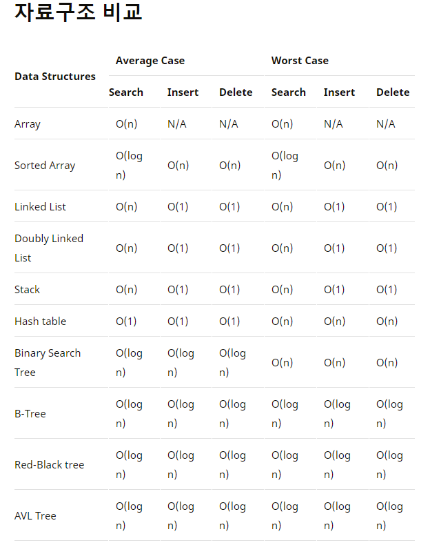
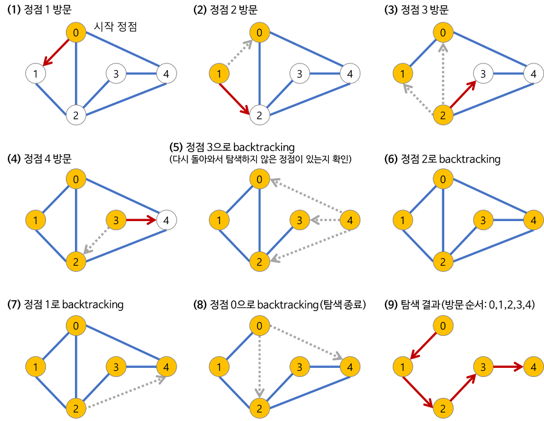
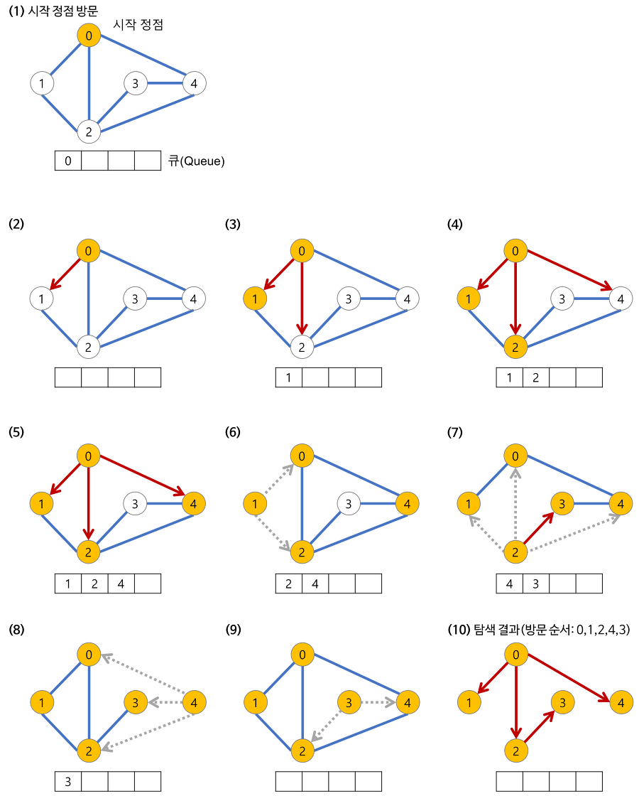
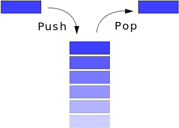
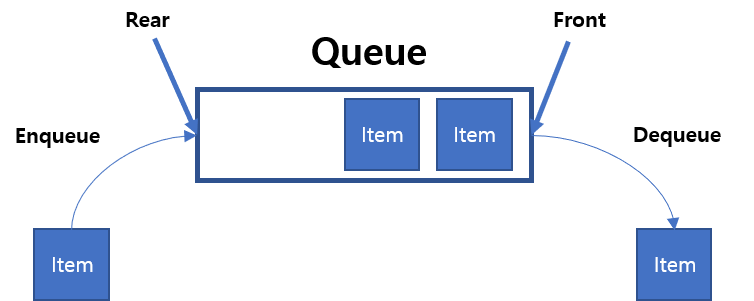
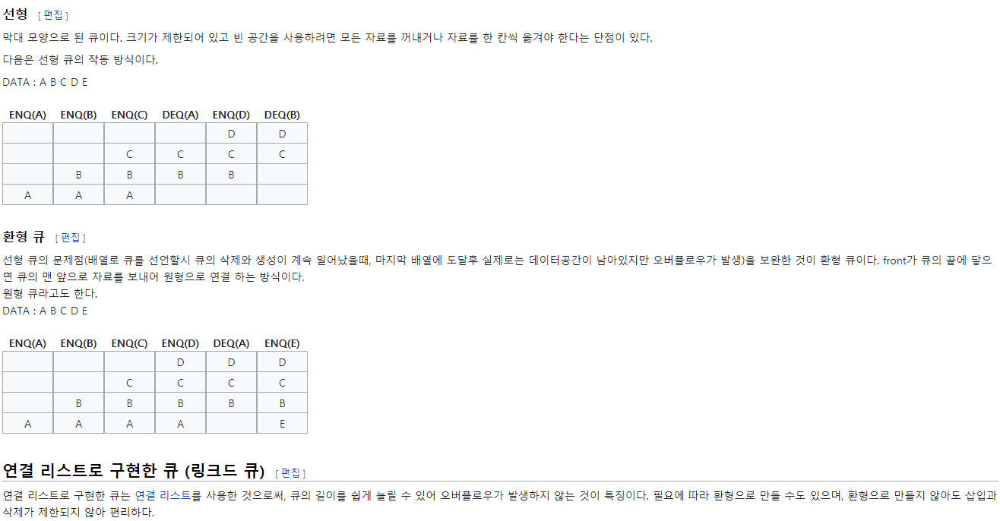
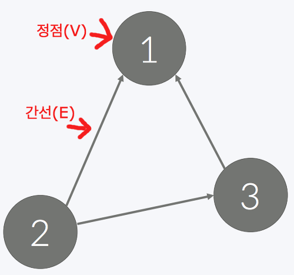
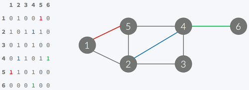

# DATASTRUCTURE

**:Contents**
* [BigO](#BigO)
* [DFS와 BFS의 차이](#DFS와_BFS의_차이)
* [Array와_LinkedList차이](#Array와_LinkedList차이)
* [Hash](#Hash)
* [Stack](#Stack)
* [Queue](#Queue)
* [Graph](#Graph)
* [Tree](#Tree)
* [그래프(Graph)와 트리(Tree)의 차이점](#Replication)
* [B+Tree](#B+Tree)
* [정렬 알고리즘의 종류와 개념](#정렬_알고리즘의_종류와_개념)


### 정렬 알고리즘의 종류와 개념
* [버블 정렬(Bubble Sort)](https://gmlwjd9405.github.io/2018/05/06/algorithm-bubble-sort.html)
* [삽입 정렬(insertion sort)](https://gmlwjd9405.github.io/2018/05/06/algorithm-insertion-sort.html)
* [선택 정렬(selection sort)](https://gmlwjd9405.github.io/2018/05/06/algorithm-selection-sort.html)
* [합병 정렬(merge sort)](https://gmlwjd9405.github.io/2018/05/08/algorithm-merge-sort.html)
* [퀵 정렬(quick sort)](https://gmlwjd9405.github.io/2018/05/10/algorithm-quick-sort.html)
* [힙 정렬(heap sort)](https://gmlwjd9405.github.io/2018/05/10/algorithm-heap-sort.html)
* [셸 정렬(shell sort)](https://gmlwjd9405.github.io/2018/05/08/algorithm-shell-sort.html)
* 정렬 알고리즘의 애니메이션 보기
  * -> [https://www.toptal.com/developers/sorting-algorithms](https://www.toptal.com/developers/sorting-algorithms)
  
  
`출처`
https://gmlwjd9405.github.io/
-----------------------------------------------------------------
### BigO
#### Big-O
- big-O는 알고리즘의 효율성을 나타내는 지표. 
- big-O를 이용하여 내가 개선한 알고리즘이 빨라졌는지, 메모리를 많이 잡아 먹지는 않는지 등의 알고리즘의 성능을 판단합니다.

#### 시간 복잡도(Time Complexity)
- 알고리즘에 사용되는 연산횟수의 총량  
- big-O에 대한 시간 개념으로 알고리즘의 수행 시간이 얼마인지를 나타냅니다. 수행되는 연산의 수를 가지고 계산하며 알고리즘에서 중요하지 않는 값들은 최대한 무시합니다.
- 입력 값(N)에 따라서 실제 소요되는 시간이 big-O에 의한 결과와 다를 수도 있습니다. 예를 들어 특정 입력 값에 대해 O(N)이 O(1)보다 빠를 수도 있습니다. 하지만 이는 big-O에서 무시합니다. 그 이유는 big-O는 단순히 증가하는 비율을 나타내는 개념으로, 데이터의 입력이 충분히 큰 것을 가정합니다. 알고리즘의 효율성은 데이터의 입력 값이 얼마나 큰지에 따라 영향을 받기 때문에 이런 사소한 부분을 무시할 수 있는 것입니다.
> 상수항 무시 / 영향력 없는 항 무시
>> O(2N) -> O(N)    
>> O(N² + 2) -> O(N²)    
>> O(N² + N) -> O(N²)    
>> - O(N²)이 가장 지배적이기 때문에 그 외에 영향력이 없는 항들은 무시합니다.

- big-O에는 다양한 실행 시간이 존재하지만 자주 사용 되는 것들은 아래와 같습니다.    
  O(1) < O(log n) < O(n) < O(n log n) < O(n²) < O(2ⁿ) < O(n!) < O(nⁿ)
> * 시간복잡도 구하는 요령
>> - 하나의 루프를 사용하여 단일 요소 집합을 반복 하는 경우 : O (n)
>> - 컬렉션의 절반 이상 을 반복 하는 경우 : O (n / 2) -> O (n)
>> - 두 개의 다른 루프를 사용하여 두 개의 개별 콜렉션을 반복 할 경우 : O (n + m) -> O (n)
>> - 두 개의 중첩 루프를 사용하여 단일 컬렉션을 반복하는 경우 : O (n²)
>> - 두 개의 중첩 루프를 사용하여 두 개의 다른 콜렉션을 반복 할 경우 : O (n * m) -> O (n²)
>> - 컬렉션 정렬을 사용하는 경우 : O(n*log(n))

#### 시간복잡도 자료구조 비교
  
> ** 프로그래밍을 할때 시간복잡도가 가장 낮은 알고리즘과 자료구조를 선택하여 사용한다.

#### 공간 복잡도
- 알고리즘에 사용되는 메모리 공간의 총량   
- 알고리즘이 공간을 얼마나 필요로 하는지를 나타냅니다. 요즘에는 데이터를 저장할 수 있는 메모리의 발전으로 중요도가 낮아졌다
- 예를 들어, 크기가 N인 배열을 만든다고 가정하면 공간 복잡도가 O(N)이 되고 NxN인 배열을 만들면 O(N²)이 됩니다.
- 함수의 재귀적인 호출의 경우 스택 공간도 고려해야 합니다.

`출처` https://blog.chulgil.me/algorithm/
`출처` https://cjh5414.github.io/big-o-notation/

-----------------------------------------------------------------
### DFS(깊이 우선 탐색)와 BFS(너비 우선 탐색)의 차이
#### 깊이 우선 탐색 (DFS, Depth-First Search)
- 루트 노드(혹은 다른 임의의 노드)에서 시작해서 다음 분기(branch)로 넘어가기 전에 해당 분기를 완벽하게 탐색하는 방법
1. 미로를 탐색할 때 한 방향으로 갈 수 있을 때까지 계속 가다가 더 이상 갈 수 없게 되면 다시 가장 가까운 갈림길로 돌아와서 이곳으로부터 다른 방향으로 다시 탐색을 진행하는 방법과 유사함
2. 즉 넓게(wide) 탐색하기 전에 깊게(deep) 탐색함 
3. 모든 노드를 방문하고자 하는 경우에 이 방법을 선택함
4. 깊이 우선 탐색(DFS)이 너비 우선 탐색(BFS)보다 좀 더 간단함
5. 검색 속도 자체는 너비 우선 탐색(BFS)에 비해서 느림

#### 깊이 우선 탐색(DFS)의 특징
- 자기 자신을 호출하는 순환 알고리즘의 형태를 지님
- 이 알고리즘을 구현할 때 가장 큰 차이점은 그래프 탐색의 경우 어떤 노드를 방문했었는지 여부를 반드시 검사해야한다는 것 (이를 검사하지 않을 경우 무한루프에 빠질 위험이 있음)

#### 깊이 우선 탐색(DFS)의 과정
  


#### 너비 우선 탐색 (BFS, Breadth-First Search)
- 루트 노드(혹은 다른 임의의 노드)에서 시작해서 인접한 노드를 먼저 탐색하는 방법
1. 시작 정점으로부터 가까운 정점을 먼저 방문하고 멀리 떨어져 있는 정점을 나중에 방문하는 순회 방법
2. 즉 깊게(deep) 탐색하기 전에 넓게(wide) 탐색하는 것
3. 두 노드 사이의 최단 경로 혹은 임의의 경로를 찾고 싶을 때 이 방법을 선택함
> ex) 지구 상에 존재하는 모든 친구 관계를 그래프로 표현한 후 Ash 와 Vanessa 사이에 존재하는 경로를 찾는 경우
>> * 깊이 우선 탐색의 경우 - 모든 친구 관계를 다 살펴봐야할지도 모름
>> * 너비 우선 탐색의 경우 - Ash와 가까운 관계부터 탐색

#### 너비 우선 탐색(BFS)의 특징
- BFS 는 재귀적으로 동작하지 않는다.
- 이 알고리즘을 구현할 때 가장 큰 차이점은 그래프 탐색의 경우 어떤 노드를 방문했었는지 여부를 반드시 검사해야한다는 것이다 이를 검사하지 않을 경우 무한 루프에 빠질 위험이 있다.
- BFS 는 방문한 노드들을 차례로 저장한 후 꺼낼 수 있는 자료 구조인 큐(Queue)를 사용함 
- 즉 선입선출(FIFO) 원칙으로 탐색

#### 너비 우선 탐색(BFS)의 과정
- 깊이가 1인 모든 노드를 방문하고 나서 그 다음에는 깊이가 2인 모든 노드를, 그 다음에는 깊이가 3인 모든 노드를 방문하는 식으로 계속 방문하다가 더 이상 방문할 곳이 없으면 탐색을 마친다.
  

#### DFS(깊이 우선 탐색)와 BFS(너비 우선 탐색)의 차이
  
- 탐색의 차이는 이름 그대로, 깊이, 너비를 기준으로 탐색하고 있다.
- DFS는 스택(or 재귀)을 사용하고, BFS는 큐를 사용한다.
- 구현에 있어서, 인접행렬 또는 인접리스트를 통해 구현할 수 있다. 

`출처` https://kayuse88.github.io/dfs-bfs/    
`출처` https://mygumi.tistory.com/102    
`출처` https://yunyoung1819.tistory.com/86    


------------------------------------------------

### Hash
#### HashMap에서 충돌이 발생한 경우 다양한 방법
* Separate chaining : 추가적인 공간을 활용하여 해결하는 방식
 * Linked list 사용


* Open addressing : 충돌 발생시 인접한 비어있는 공간에 저장
 * Linear pribing : 고정폭으로 이동하여 빈 공간을 찾음
 * Quadratic probing : 제곱수로 이동하여 빈 공간을 찾음
 * Double hashing : 또다른 hash function을 사용하여 빈 공간을 찾음 

### Stack
#### Stack이란?
 
- 한 쪽 끝에서만 자료를 넣고 뺄 수 있는 LIFO(Last In First Out) 형식의 자료 구조
- 사용 사례 : 웹 브라우저 방문기록 (뒤로가기) / 실행 취소 (undo) / 역순 문자열 만들기
- <주의점>
>> ** stack은 검색이란 기능을 재공하지 않고 검색이 없으니 갱신(수정)도 없다.    
>> ** 제일 위의 데이터만 알 수 있다. / 데이터의 갯수는 알 수 있다.     
>> ** 중간의 데이터는 알 수 없다. 만약 알고싶다면 제일 위부터 모두 꺼내야한다.     
>> ** 제일 처음 들어간 자료는 모든 자료를 꺼내기 전까지 확인할 수 없고 반대로 제일 마지막에 들어간 자료는 바로 꺼낼 수 있다.    

#### 스택(Stack)의 연산 - java 라이브러리 스택(Stack) 관련 메서드
1. push(E item) 
 > 해당 item을 Stack의 top에 삽입
 > Vector의 addElement(item)과 동일
2. pop()
 > Stack의 top에 있는 item을 삭제하고 해당 item을 반환
3. peek()
 > Stack의 top에 있는 item을 삭제하지않고 해당 item을 반환
4. empty()
 > Stack이 비어있으면 true를 반환 그렇지않으면 false를 반환
5. search(Object o)
 > 요소 찾기 : 없으면 -1, 있으면 위치 리턴 (top부터 1)

#### Stack의 시간복잡도
- push -> O(1) 
- pop -> O(1)
- peek -> O(1)
> 무조건 제일 위에 것을 기준으로 하니까 시간복잡도가 상수시간 1이 나옵니다.
- empty - > O(1)
> 이게 널인지 아닌지만 확인해주면 되기 때문에 무조건 시간복잡도가 1이 나옵니다.
- size -> O(1) or O(n)
> 스택의 구현방식에 따라 다릅니다.    
> 스택을 배열로 만들면 무조건 시간 복잡도가 1이나옵니다. [항상 size를 기재하기 때문]    
> 리스트로 구현할 경우 내부적으로 끝에서 끝까지 운행을 끝마쳐야 하기 때문에 시간복잡도는 O(n)이 됩니다.    

`출처` https://blog.naver.com/justkukaro/220503515118
------------------------------------------------

### Queue

#### Queue란?
 
- 먼저 들어간 자료가 먼저 나오는 구조 FIFO(First In FIrst Out-선입선출) 구조  
- front(head)와 rear(tail)는 데이터의 위치를 가리킨다
- 큐는 한 쪽 끝은 프런트(front)로 정하여 삭제 연산(Dequeue)만 수행함
- 다른 한 쪽 끝은 리어(rear)로 정하여 삽입 연산(Enqueue)만 수행함  
- 큐가 꽉 차서 더 이상 자료를 넣을 수 없는 경우(put 할 수 없는 경우)를 오버플로우(Overflow), 큐가 비어 있어 자료를 꺼낼 수 없는 경우(get 할 수 없는 경우)를 언더플로우(Underflow)라고 한다.
- 그래프의 넓이 우선 탐색(BFS)에서 사용
- 컴퓨터 버퍼에서 주로 사용, 마구 입력이 되었으나 처리를 하지 못할 때, 버퍼(큐)를 만들어 대기 시킴

 

#### 큐(Queue)의 연산 - java 라이브러리 큐(Queue) 관련 메서드
- offer(Element data);       //Queue(큐)에 객체를 넣는다(put)
- Element poll();           //가장 먼저 보관한 값 꺼내고 반환(dequeue)
- Element peek();           //가장 먼저 보관한 값 단순 참조, 꺼내지 않음
- boolean empty();         //비어있는지 판별

`출처` https://galid1.tistory.com/483

#### 덱/데크 (Deque)
- 큐의 양쪽 끝에서 삽입과 삭제가 모두 발생할 수 있는 큐로서, 큐와 스택의 성질을 모두 가지고 있는 자료구조
- 덱의 insertFront(), deleteFront() 연산은 Front 를 top으로 생각했을 때 스택의 push(), pop() 연산과 같고,    
  insertRear(), deleteRear() 연산은 rear를 스택의 top으로 생각했을 때 스택의 push(), pop() 연산과 같다.    
- 덱의 insertRear(), deleteFront() 연산은 일반 큐의 enQueue(), deQueue() 연산과 같다. 
 

`출처` https://songeunjung92.tistory.com/25
------------------------------------------------

#### Graph
#### 그래프란?
- 정점과 간선으로 이루어진 자료구조의 일종. G = (V, E)
- 정점은 각 출발점 도착점과 같은 점이라고 보면 되고, 간선은 그 정점간 연결된 관계를 뜻한다.
  
- 그래프의 탐색/순회 : 하나의 정점으로부터 시작하여 차례대로 모든 정점들을 한 번씩 방문하는 것    
  > 주어진 어떤 정점에서 출발하여 체계적으로 그래프의 모든 점점을 순회하는 것으로 깊이를 우선하는 깊이 우선 탐색(DFS)과 너비를 우선하는 너비 우선 탐색(BFS)이 있습니다.

#### 인접행렬과 인접리스트, 시간복잡도
##### 인접행렬
  
- 인접행렬은 정점(V)이 n개일 때 N*N 이차원 배열로 나타낼 수 있다.
- 인접행렬을 일반적으로 a라고 이름을 짓는다.
- a[1][5] = 1 의 의미는 정점 1과 정점 5의 간선이 연결되어 있다는 뜻이다.
- 무방향이기에 a[5][1] 또한 1이다. 빨간색을 통해 확인하자.
- 인접행렬의 값이 1이라면, 정점간의 간선이 존재한다는 것이고, 0이라면 존재하지 않는다는 것이다.
```java
    int[][] a = new int[n + 1][n + 1];
    
    for (int i = 0; i < m; i++) {
        int v1 = sc.nextInt(); 
        int v2 = sc.nextInt(); 
        a[v1][v2] = 1; 
        a[v2][v1] = 1; 
    }
```

##### 인접리스트
 
- 1에 연결되어있는 간선들을 A[1] 에 저장하고, A[2]에는 2에 연결되어있는 간선을 저장했다.

```java
    ArrayList<Integer>[] a = (ArrayList<Integer>[]) new ArrayList[n + 1];
    
    for (int i = 0; i <= n; i++) {
        a[i] = new ArrayList<>();
    }    
    for (int i = 0; i < m; i++) {
        int v1 = sc.nextInt();
        int v2 = sc.nextInt();
    
        a[v1].add(v2);
        a[v2].add(v1);
    }
```

#### 인접행렬과 인접리스트의 차이 & dfs와 bfs의 시간복잡도
>* 정점(노드)의 수 : V, 간선의 수: E
>* 인접 리스트로 표현된 그래프 : O(V+E)
>* 인접 행렬로 표현된 그래프 : O(V^2)
- 인접행렬 : 크기가 정점과 간선의 갯수와 상관없이 정점갯수 * 정점갯수 이기 때문에 공간복잡도가 O(v^2) 이다.
- 인접리스트 : 필요한 공간만 쓰기 때문에 O(V+E) 
- 인접 행렬의 경우 정점을 탐색하는 과정에서 무조건 1에서 n까지 루프를 돌았다.    
  인접 리스트의 경우에는 리스트 특성상 각 리스트마다 존재하는 정점만큼 존재한다.
  그렇기에 i에서 n까지 돌지 않아도 되고, 존재하는 만큼만 탐색하면 된다.
- 인접행렬을 쓰는 것보다는 인접리스트가 효율적이다.
- dfs와 bfs의 시간 복잡도는 동일하다 모든 정점을 한 번씩 방문하며, 정점을 방문할 때마다 인접한 모든 간선을 검사하기 때문이다    
