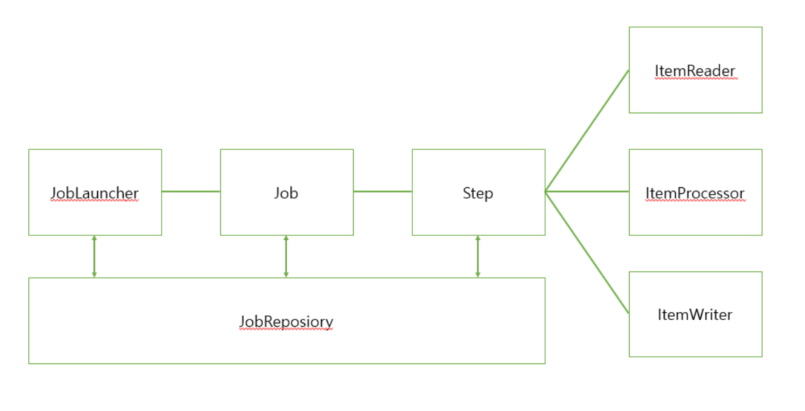
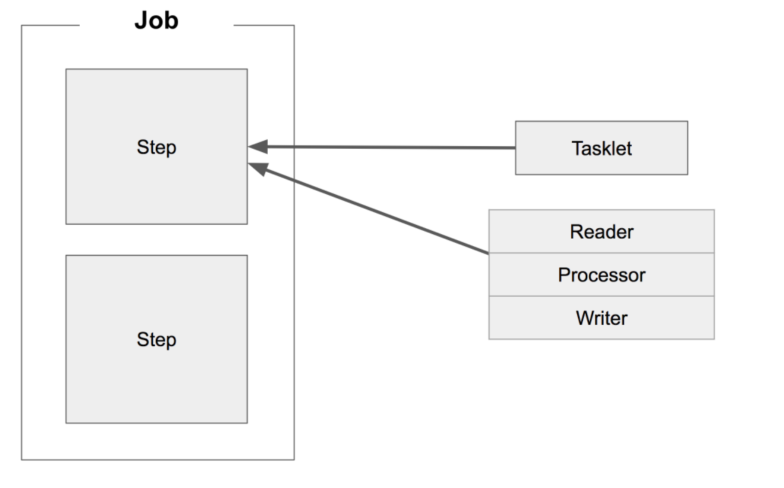
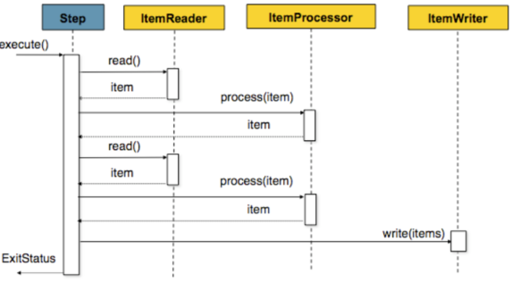
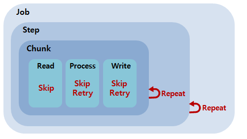

# spring batch

**:Contents**
* [왜 spring batch 인가] 
* [spring batch란]
* [처리대상이 많은 데이터는]
* [멱등성 유지하기]
* [spring batch 테이블]
* [배치 어떻게 실행 시켰는지]
* [배치 중간 실패하면 어떻게 처리하는지]
* [spring batch multi thread vs partitioning]
* [tasket vs read ,processor,wirte]
* [spring batch 에서 트랜잭션 관리 왜 청크 단위로 하는지]
* [Cursor기반 vs Paging기반]
cf).https://n1tjrgns.tistory.com/159


### 왜 spring batch 인가?

* 효과적인 로깅, 통계 처리, 트랜잭션 관리 등 재사용 가능한 필수 기능을 지원한다.
* 수동으로 처리하지 않도록 자동화되어 있다.
* 예외사항과 비정상 동작에 대한 방어 기능이 있다.
* 스프링 부트 배치의 반복되는 작업 프로세스를 이해하면 비즈니스 로직에 집중 할 수 있다.


-----------------------------------------------

### standardize process flow위한 기능

#### Tasket model
* 간단한 process에 사용

#### Chunk model
* 대량의 데이터를 효율적으로 처리
* 고정 된 양의 데이터를 일괄 적으로 read / process / writer 하는 방법

### 다양한 데이터 형식의 I / O
* 파일, 데이터베이스, 메시지 큐 등과 같은 다양한 데이터 리소스에 대한 입출력을 쉽게 수행 할 수 있습니다.

### 효율적인 처리
* 설정에 따라 다중 실행, 병렬 실행, 조건 분기가 수행됩니다.

### 작업 실행 제어
* 데이터 레코드를 표준으로 사용하여 영구 실행, 재시작 작업을 수행 할 수 있습니다.


### spring batch 주의 사항


### spring batch의 기본 구조



* Job과 Step 1:M
* Step과 ItemReader, ItemProcessor, ItemWriter 1:1
* Tasklet 하나와 Reader & Processor & Writer 한 묶음이 같은 레벨이다.



### 청크 지향 프로세싱 프로세스



#### 용어 정리
`Job`<br>
* Spring Batch의 배치 애플리케이션을위한 일련의 프로세스를 요약하는 단일 실행 단위입니다

`Step`<br>
* Job을 구성하는 처리 단위입니다. 하나의 작업은 1 ~ N 개의 단계를 포함
* 단계는 청크 모델 또는 태스크 모델 (나중에 설명)에 의해 구현됩니다.

`JobLauncher`<br>
* 작업 실행을위한 인터페이스입니다.

`JobRepository`<br>
* Job 및 Step의 상태를 관리하는 시스템입니다.<br>
관리 정보는 Spring Batch에서 지정한 테이블 스키마를 기반으로 데이터베이스에 유지됩니다.


https://terasoluna-batch.github.io/guideline/5.0.1.RELEASE/en/Ch02_SpringBatchArchitecture.html#Ch02_SpringBatchArch_Overview


-----------------------------------------------

### 처리대상이 많은 데이터를 처리하는 경우 어떻게 처리를 하였는지?

>> 파티셔닝을 사용한 병렬 프로그래밍 방식을 이용하여 처리 속도 개선을 하였습니다.

* partitioner gridSize는 3으로 설정하여 사용
gridSize가 크다고 무조건 좋은게 아니다.<br>
스레드를 생성하여 사용하기 때문에 자원과 연결이 되어 있기때문에 실무에서 사용하는 서버에 상황에 맞게 설정하여<br>
최적화해야 한다.


-----------------------------------------------

### Spring Batch의 멱등성 유지하기

`멱등성`<br>
* 연산을 여러번 적용하더라도 결과가 달라지지 않는 성질

 Spring Batch를 사용하다보면 동적으로 변하는 날짜를 사용하는 경우가 있습니다.
 ex).<br>
*  매일 한번 어제 매출 데이터를 집계해야할 때
*  현재 시간을 기준으로 유효기간이 만료된 포인트를 정리할 때
*  매일 한번 오늘을 기준으로 휴면회원 처리를 할 때

그래서 주로 LocalDate.now()를 통해 그날 그날의 데이터를 집계합니다.<br>
하지만 이슈가 발생해서 어제 데이터를 다시 처리할 필요가 생긴다면 LocalDate.now()로 날짜를 정해서 처리하는 방식에는 문제가 생깁니다.<br>
하지만 이슈가 발생해서 어제 데이터를 다시 처리할 필요가 생긴다면 LocalDate.now()로 날짜를 정해서 처리하는 방식에는 문제가 생깁니다.<br>

`이런 문제가 발생한 이유는`<br>
* 제어할 수 없는 코드가 내부에 있기 때문
* new Scanner(System.in), LocalDate.now(), new Random() 등 결과를 개발자가 제어할 수 없는 코드는 내부에서 사용 하면 안됩니다.

>> 그래서 실무에서는 jobParameter값에 날짜가 없는 경우에만 LocalDate.now() 날짜를 정해서 집계를 하는 방식으로 운영하고 있습니다. 


-----------------------------------------------

### 배치 중간 실패하면 어떻게 처리하는지



* Skip은 데이터를 처리하는 동안 설정된 Exception이 발생했을 경우, 해당 데이터 처리를 건너뛰는 기능이다. 
* 데이터의 사소한 오류에 대해 Step의 실패처리 대신 Skip을 함으로써, 배치수행의 빈번한 실패를 줄일 수 있게 한다.


|항목|설명|
|------------------|------|
|skip-limit|Skip 할 수 있는 최대 횟수를 지정
            default=0 이므로 꼭 지정해줘야 Skip기능 사용 할 수 있음 (확인필요)|
|<skippable-exception-classes> - include | 	skip 해야하는 Exception 범위를 지정 |
|<skippable-exception-classes> - exclude | nclude로 지정한 exception의 하위 exception 중, Skip하지 않을 Exception 지정 |

> skippable-exception-classes


 ```xml

<step id="step1">
 <tasklet>
  <chunk reader="flatFileItemReader" writer="itemWriter" commit-interval="10" skip-limit="10">
   <skippable-exception-classes>
    <include class="org.springframework.batch.item.file.FlatFileParseException"/>
   </skippable-exception-classes>
  </chunk>
 </tasklet>
</step>

```


* Retry는 데이터를 Processing, Writing 하는 동안 설정된 Exception이 발생했을 경우, 지정한 정책에 따라 데이터 처리를 재시도하는 기능이다
* Item Processing과 Item Writing 과정에서만 Retry 된다.
* Read과정까지 성공한 데이터는 캐쉬에 저장된다. 그러므로 재시도가 일어날 경우 캐쉬의 데이터를 가져와 Process 과정부터 다시 수행한다.

> retryable-exception-classes

|항목|설명|
|------------------|------|
|retry-limit|Retry 할 수 있는 최대 횟수를 지정|
|<retryable-exception-classes> - include | 	Retry 해야하는 Exception 범위를 지정 |
|<retryable-exception-classes> - exclude | include로 지정한 exception의 하위 exception 중, Retry하지 않을 Exception 지정|

 ```xml

<step id="step1">
 <tasklet>
  <chunk reader="itemReader" writer="itemWriter" commit-interval="2" retry-limit="3">
   <retryable-exception-classes>
    <include class="org.springframework.dao.DeadlockLoserDataAccessException"/>
   </retryable-exception-classes>
  </chunk>
 </tasklet>
</step>

```


cf ). https://www.egovframe.go.kr/wiki/doku.php?id=egovframework:rte2:brte:batch_core:skip_repeat_retry


-----------------------------------------------------------------------


### spring batch multi thread vs partitioning

* 멀티쓰레드 Step과 더불어 파티셔닝 (Partitioning)은 Spring Batch의 대표적인 Scalling 기능입니다.

* `multi thread`
* 멀티쓰레드 Step은 단일 Step을 Chunk 단위로 쓰레드를 생성해 분할 처리 하게 됩니다.
    * 어떤 쓰레드에서 어떤 데이터들을 처리하게 할지 세밀한 조정이 불가능합니다.
    * 또한, 해당 Step의 ItemReader/ItemWriter 등이 멀티쓰레드 환경을 지원하는지 유무가 굉장히 중요합니다.

* `partitioning`
* 반면 파티셔닝 (Partitioning)의 독립적인 Step (Worker Step)을 구성하고, 그에 따른 각각 별도의 StepExecution 파라미터 환경을 가지게 하여 처리 합니다.
    *(Local로 실행할 경우) 멀티쓰레드으로 작동하나, 멀티쓰레드 Step과는 별개로 ItemReader/ItemWriter의 멀티쓰레드 환경 지원 여부가 중요하지 않습니다
    
    
### spring batch 에서 트랜잭션 관리 왜 청크 단위로 하는지
* 청크 지향프러그래밍의 이점은 1000개 개의 데이터에 대해 배치 로직을 실행한다고 가정했을 때 
* 청크로 나누지 않았을 때는 하나만 실패해도 다른 성공한 999개의 데이터가 롤백됩니다.
* 그런데 청크 단위를 10으로 해서 배치처리를 하면 도중에 배치 처리에 실패하더라도 다른 청크는 영향을 받지 않습니다. 
* 이러한 이유로 스프링 배치에 청크 단위로 프로그래밍을 지향합니다.