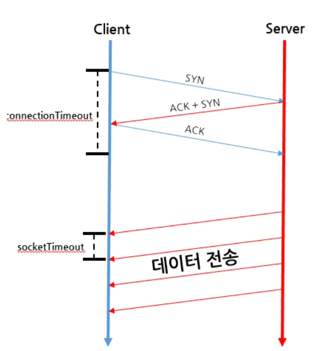

# Web

**:Contents**
* [connection]
* [3-way-HandShake]
* [restapi란]
* [암호화]
* [TCP 상태에서 timeout wait / close wat 상태에 대해서 말해보아라(tcp 종료 4way handshake)]
* [http1 2 3차이]
* [네트워크 7 layer]
* [forward vs redirect]
* [Keep Alive]
* [cors]

### connection timeout , socket timeout , read timeout

`connection timeout` 
> ConnectionTimeout이란 3-way HandShake가 정상적으로 수행되어 서버에 연결되기까지 소요된시간이다
   
`socket timeout` 
> SocketTimeout이란 데이터를 여러개의 패킷으로 나누어 보낼때 각 패킷간의 시간 Gap을 이야기한다

`read timeout` 
> Connection 맺은 후 Response(응답)을 받기까지 소요될 시간의 임계치이다

  

cf) https://coding-start.tistory.com/112
  

### 3-way-HandShake
> 두 호스트 간에 연결을 맺고 최종적인 통신 목적지까지 데이터를 전달하는 기능을 한다
> 먼저 정확한 전송을 보장하기 위해 상대방 컴퓨터와 사전에 세션을 수립하는 과정을 의미
> 이때 통신을 시작할 때 거치는 과정을 3 Way Handshake, 통신을 마칠 때 거치는 과정을 4 Way Handshake라고 한다

* TCP는 전송계층에 속해있다.
* 전송 계층에는 크게 TCP(Transmission Control Protocol) 와 UDP(User Datagram Protocol) 2가지 프로토콜이 있다

`TCP` 
* SYN은 'synchronize sequence numbers', 그리고 ACK는'acknowledgment' 의 약자이다.

`3 Way Handshake` 
[STEP 1]
* A클라이언트는 B서버에 접속을 요청하는 SYN 패킷을 보낸다.
* 이때 A클라이언트는 SYN 을 보내고 SYN/ACK 응답을 기다리는 SYN_SENT 상태, B서버는 Wait for Client 상태이다.

 

[STEP 2] 
* B서버는 SYN요청을 받고 A클라이언트에게 요청을 수락한다는 ACK 와 SYN flag 가 설정된 패킷을 발송하고
* A가 다시 ACK으로 응답하기를 기다린다. 이때 B서버는 SYN_RECEIVED 상태가 된다.

 

[STEP 3]
* A클라이언트는 B서버에게 ACK을 보내고 이후로부터는 연결이 이루어지고 데이터가 오가게 되는것이다.
* 이때의 B서버 상태가 ESTABLISHED 이다.
* 위와 같은 방식으로 통신하는것이 신뢰성 있는 연결을 맺어 준다는 TCP의 3 Way handshake 방식이다.

`4 Way Handshake` 

[STEP 1]
* 클라이언트가 연결을 종료하겠다는 FIN플래그를 전송한다. 이때 A클라이언트는  FIN-WAIT 상태가 된다.

[STEP 2] 
* B서버는 FIN플래그를 받고, 일단 확인메시지 ACK 보내고 자신의 통신이 끝날때까지 기다리는데 이 상태가
* B서버의 CLOSE_WAIT상태다.

[STEP 3]
* 연결을 종료할 준비가 되면, 연결해지를 위한 준비가 되었음을 알리기 위해  클라이언트에게 FIN플래그를 전송한다. 이때 B서버의 상태는 LAST-ACK이다.

[STEP 4]
* 클라이언트는 해지준비가 되었다는 ACK를 확인했다는 메시지를 보낸다.
* A클라이언트의 상태가 FIN-WAIT ->TIME-WAIT 으로 변경된다.

cf). https://bangu4.tistory.com/74

`UDP` 

cf)https://sleepyeyes.tistory.com/4

### REST-API

* rest api 설계 규칙
    * 소문자만 사용
    * 언더바(_)는 쓰지 않고, 필요시 하이픈(-)을 쓰되 지양하자
    

### 암호화

* `단방향` 
    * 복호화가 불가능
    * SHA256

* `양방향` 
    * 복호화가 가능
    * 대칭키 방식
        * 특징 : 암복호화에 서로 동일한 키가 사용되는 암호화 방식. 그래서 키를 비공개한다.
        * 장점 : 속도가 빠르다.
        * 단점 : 키 배송 위험성 존재하여 송신 측에서 수신측에 암호 키를 전달하는 과정에서 노출우려가 있다.
        * 대표 : DES, AES

       
    * 비대칭키 방식
        특징 : 암복호화에 서로 다른 키가 사용되는 암호화 방식. 하나의 키는 공개키로 사용.
        장점 : 키 배송의 문제를 근본적으로 차단하여 안전성이 높다.
        단점 : 대칭키(비공개키)방식에 비해서 느리다.
        대표 : RSA

cf). https://javaplant.tistory.com/26 [자바공작소]

### TCP 상태에서 timeout wait / close wat 상태에 대해서 말해보아라(tcp 종료 4way handshake)

* CLOSE_WAIT : Close 명령을 실행할 때까지 대기하는 상태
* TIME_WAIT : 연결은 종료되었지만 분실되었을지 모를 세그먼트를 위해 당분간 소켓을 열어둠

### http1 2 3차이

* HTTP 1.1.는 기본적으로 Connection당 하나의 요청을 처리 하도록 설계되어 있어 동시전송이 불가능하고 요청과 응답이 순차적으로 이루어 지게된다.
* http2는 동시에 여러 리소스를 받아올 수 있게 되었다.
* 동시에 리소스를 받아 올 수 있게된 기술적 기반은 기존의 http1은 플레인텍스트로 구성되어 있었지만 http2에서는 데이터를 전송할 때 , 바이너리로 인코딩하여 전송하게 되었습니다.
* 바이너리 포맷의 데이터를 사용하게 되어 , 이전에는 한 뭉태기로 모여있던 데이터를 프레임이라는 단위로 나눠서 관리/ 전송할 수 있게 되었습니다.
* http2에서는 스트림 하나가 다수개의 요청고 응답을 처리 할 수 있는 구조로 바뀌었습니다.
* 동시에 여러 메세지를 처리할 수 있게 되었고 응답 프레임들은 요청순서에 상관없이 만들어진 순서대로 클라이언트에 전달될 수 잇게 되었습니다.
* 이렇게 http1때 처럼 중간에 응답이 막히면  , 대기하고 있던 response들이 모두 기다려야하는 HeadOfBlocking 이슈에서 벗어날 수 있게 되었습니다.   
* 3버전에서는 그동안 변하지 않고 TCP를 기반으로 설계되어 왔던 토대를 모두 버리고, UDP에 근간을 두는 선택

### 네트워크 7 layer

* 응용계층, 표현계층, 세션계층, 전송계층, 네트워크계층, 데이터링크 계층 , 물리계층으로 이루워져 있습니다.

* 응용계층은 사용자와 컴퓨터간의 연결을 제공할 수 있는 user 인터페이스를 제공하는 영역입니다.

* 표현계층은 7계층에서 만들어진 데이터에 확장자를 붙여 어떤 유형의 데이터인지를 알려주는 계층이며 압축화,암호화를 수행합니다.

* 세션계층은 통신 경로 확립이나 단절,전달방식을정합니다.

* 전송계층은 데이터 전송 방식을 결정하고 ,포트번호를 구분하는 계층입니다.

* 네트워크계층은 논리적 주소를 구분하고,목적지까지 최적경로를 결정해주는 계층입니다.

* 데이터링크게층은 물리적 주소를 구분하고 데이터의 전송형태를 결정하는 계층입니다.
* MAC주소를 통하여 통신을 할 수 있게 해준다.

* 물리계층은 데이터를 비트로 변환하고 비트를 전기적 신호로 변화하여 전송합니다.

------------------------------

* 응용계층은 사용자에게 네트워크를 사용할 수 있도록 인터페이스를 제공하는 역할을 합니다. 주요 프로토콜은 http가 있습니다.

* 표현 계층은 송신지와 수신지가 서로 사용할 수 있도록 데이터의 형식을 맞추는 역할입니다. 

* 세션 게층은 송수신측에 세션을 연결하고 유지하는 역할을 수행합니다. 주요 프로토콜은 ssh가 있습니다.

* 전송 계층은 패킷전송의 유효함을 체크하고 재전송 하는 신뢰성 있게 전달하는 역할을 수행하며 tcp 가 있습니다.

* 네트워크 계층은 목적지로 패킷을 전달하는 경로 선택 및 중계역할을 합니다. 

* 데이터 링크 계층은 프레임을 전달하며 오류제어의 역할이 있습니다. 

* 물리 계층은 전기적 신호로 데이터를 보내는 역할을 합니다

### forward vs redirect

`forward` 
* 현재 실행중인 페이지와 forward에 의해 호출될 페이지는 request와 response객체를 공유

`redirect` 
* 새로운 페이지에서는 request와 response객체가 새롭게 생성된다.

`어떤상황에 어떤 방식을 사용하여야 하는가` 
* 시스템(세션,DB)에 변화가 생기는 요청(로그인,회원가입,글스기)의 경우에는 redirect
* 시스템 에변가 생기지 않는 단산 조회요청의 경우 forward 

### Keep Alive

### cors

* 왜 Preflight가 필요할까?

* Access-Control-Allow-Origin : 서버 측 허가 출저
* Access-Control-Allow-Methods : 서버 측 허가 메서드
* Access-Control-Allow-Headers : 서버 측 허가 헤더
* Access-Control-Max-Age : Preflight 응답 캐시 시간

cf). https://www.youtube.com/watch?v=-2TgkKYmJt4